# Wallpapers

_This README was automatically generated by [docgen.py](.github/docgen.py) on 2026-09-11_

This is a personal collection of wallpapers organized by categories for easy access.

## Random Selection

Random wallpapers from each category are displayed below. The selection changes automatically to show different items from the collection.
## sonic

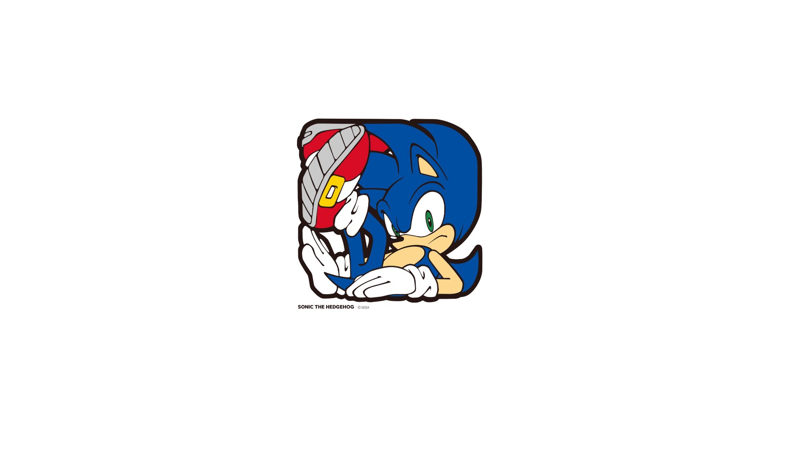

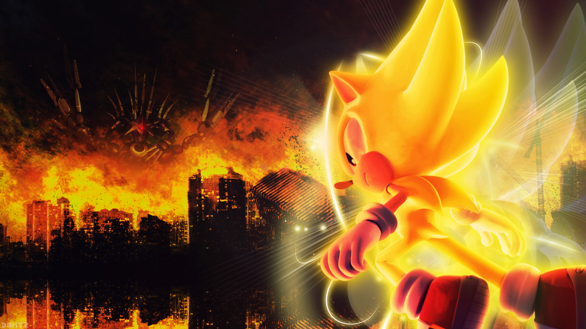

[Browse 🡪](sonic/README.md)

## lain

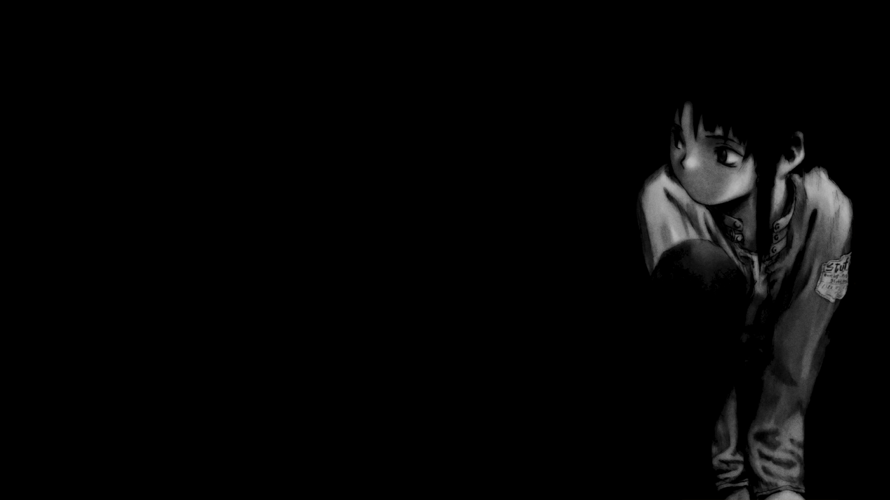

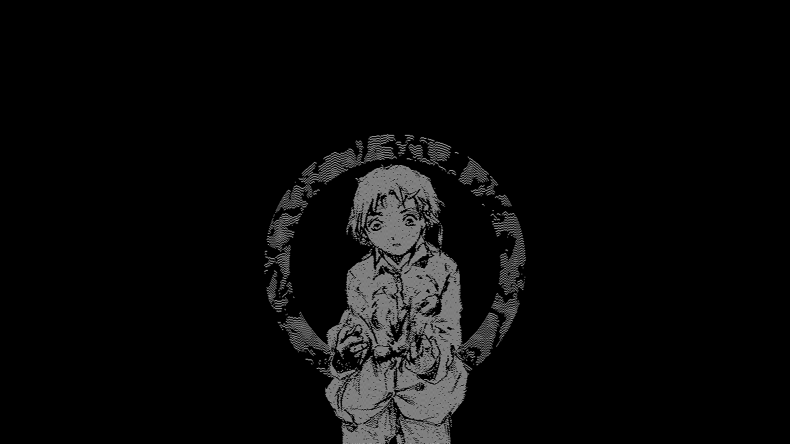

[Browse 🡪](lain/README.md)

## cyberpunk

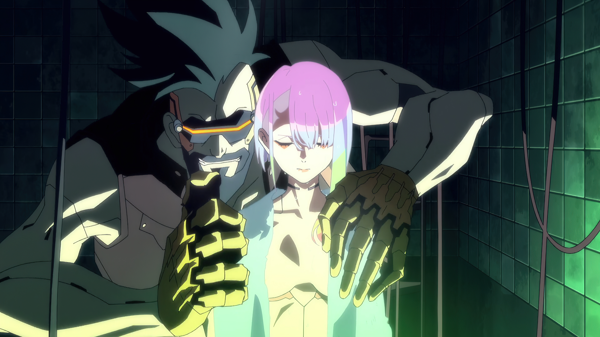

[Browse 🡪](cyberpunk/README.md)

## ghibli

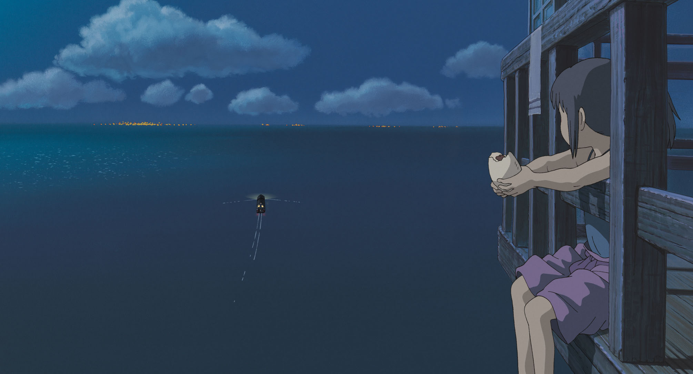

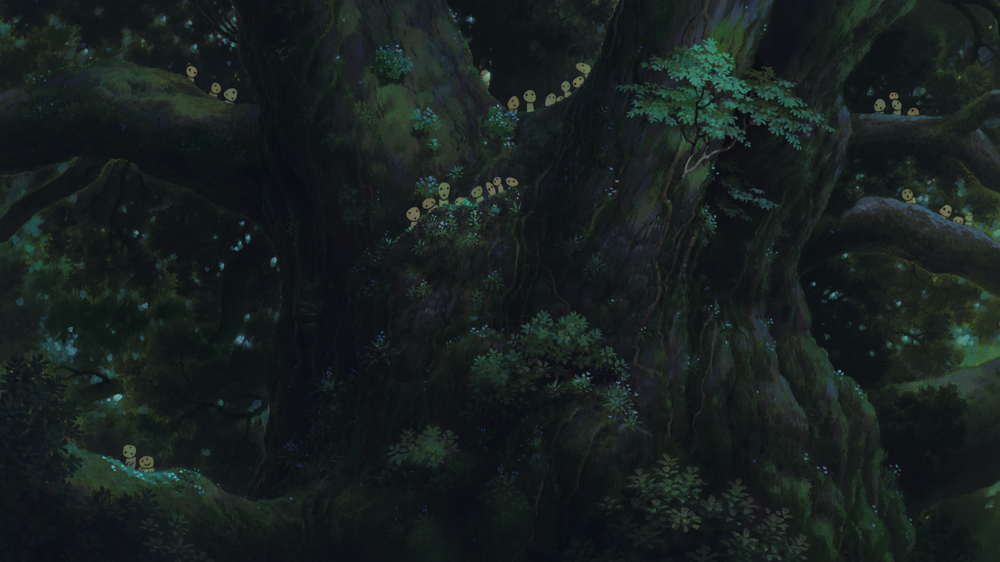

[Browse 🡪](ghibli/README.md)

## punpun

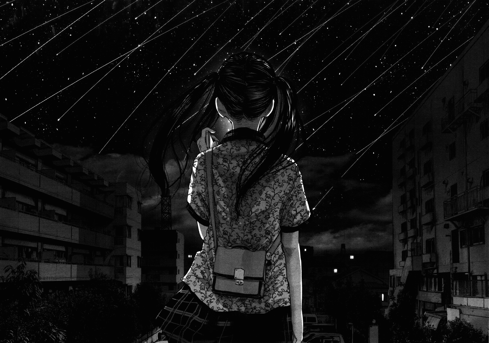

[Browse 🡪](punpun/README.md)

## evangelion

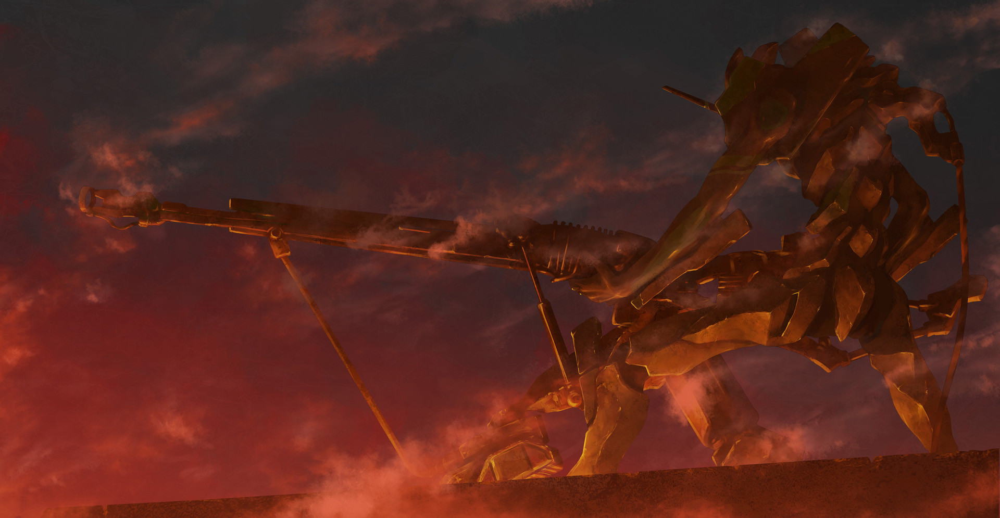

[Browse 🡪](evangelion/README.md)

## monogatari

[Browse 🡪](monogatari/README.md)

## photography

[Browse 🡪](photography/README.md)

## space

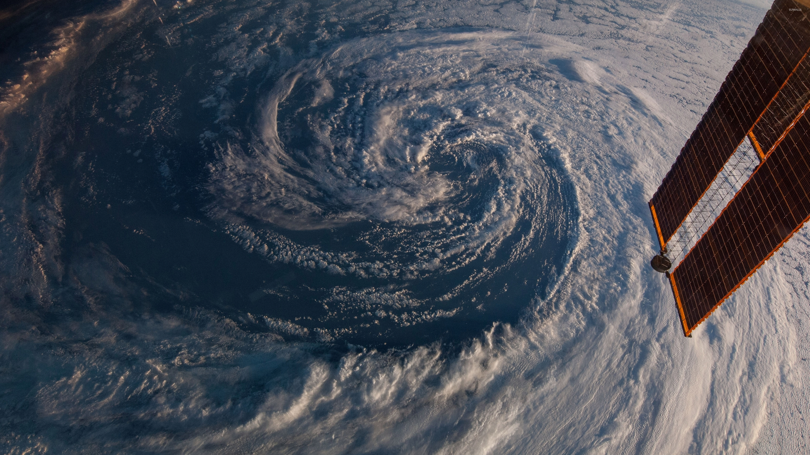

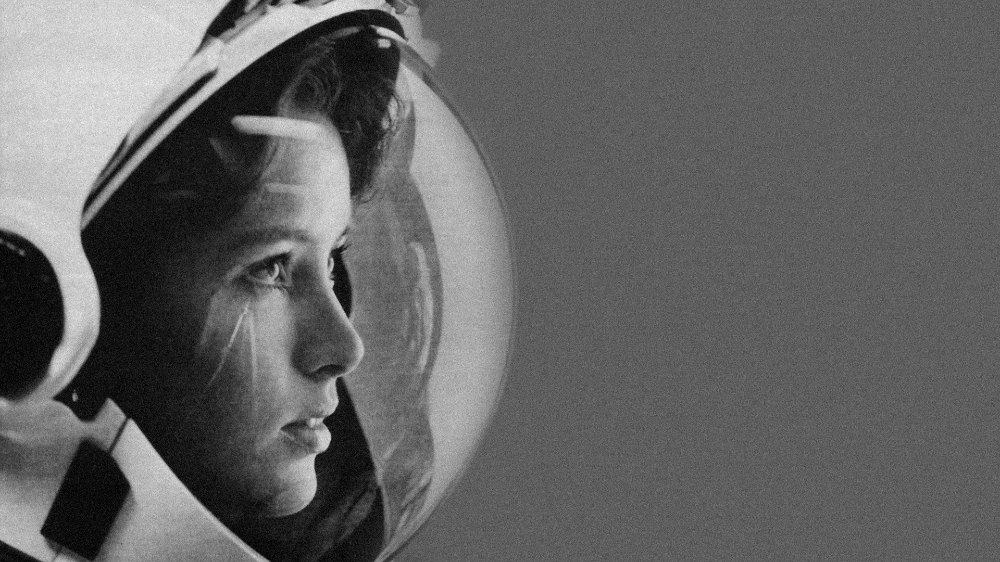

[Browse 🡪](space/README.md)

## unsorted

[Browse 🡪](unsorted/README.md)

## gorillaz

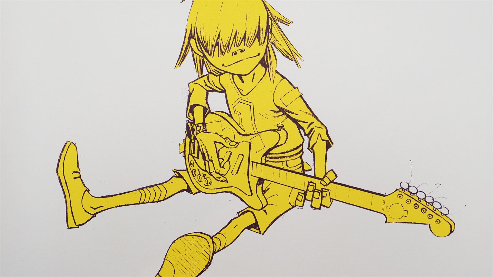

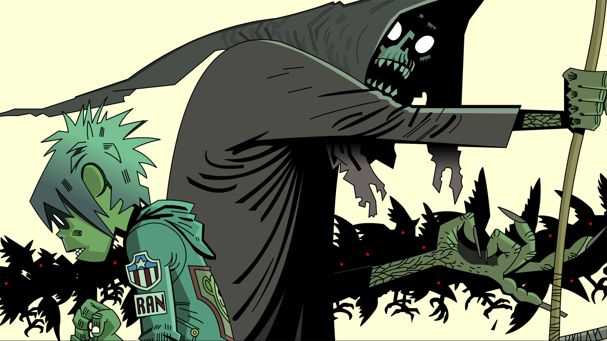

[Browse 🡪](gorillaz/README.md)

## flcl

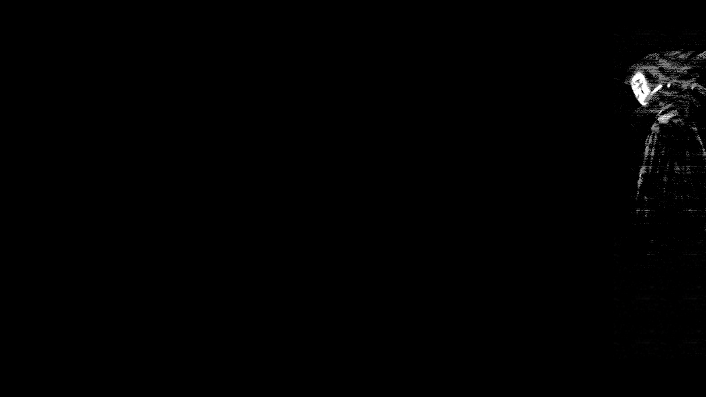

[Browse 🡪](flcl/README.md)

## Sources

This is a personal archive of wallpapers collected from various sources over time. It is used for personal backup and organization purposes.

All wallpapers belong to their respective creators and owners. If you find an image in this repository that is yours and you want it remove, please contact me.